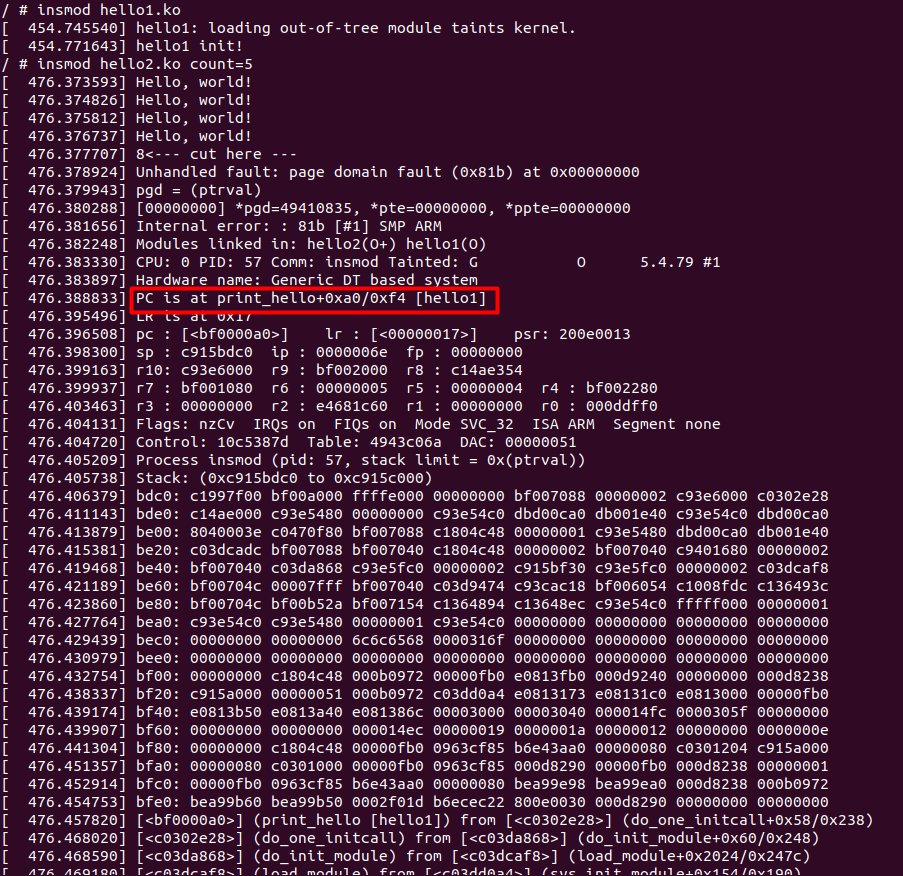
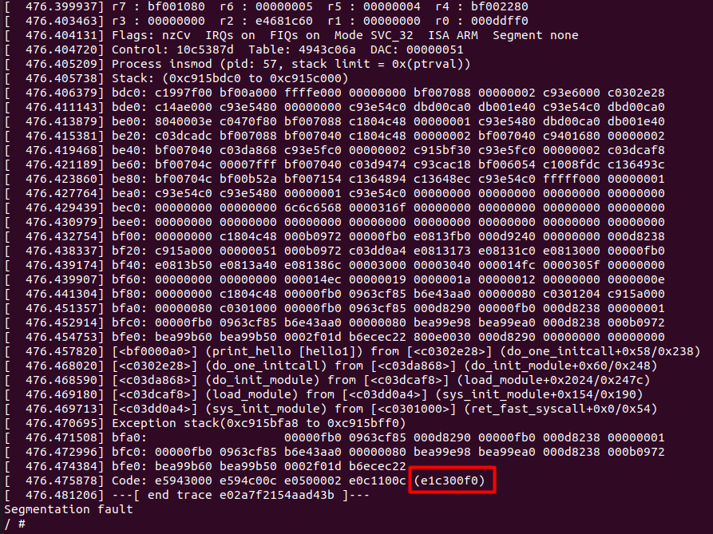
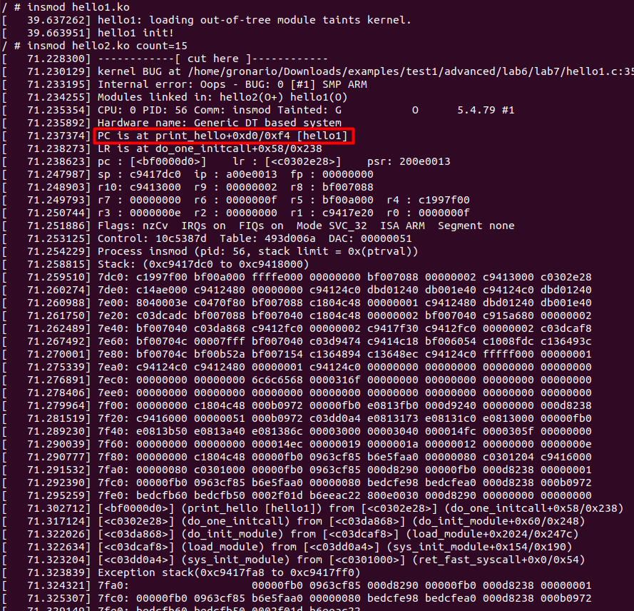
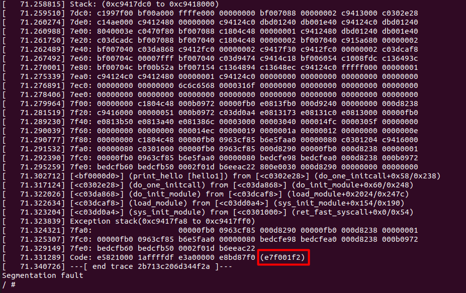
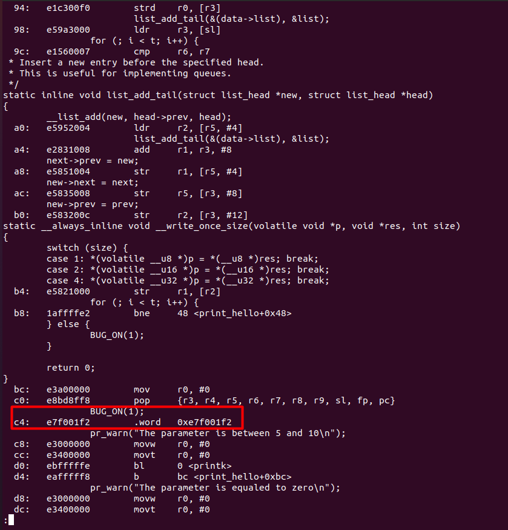
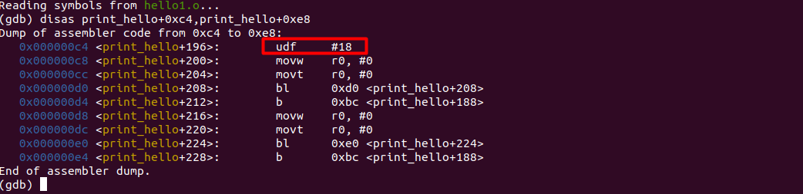

# AK_2_Lab_7 #
Виконав Денисюк Роман ІО-83
## Повідомлення про помилку, а саме виділено 0 пам'яті для елемента

## Продовження дебагу

## Повідомлення про помилку ( BUG_ON(1) )

## Продовження дебагу

## Пошук місця помилки для BUG_ON(1) за допомогою objdump

## Пошук місця помилки для BUG_ON(1) за допомогою jdb

